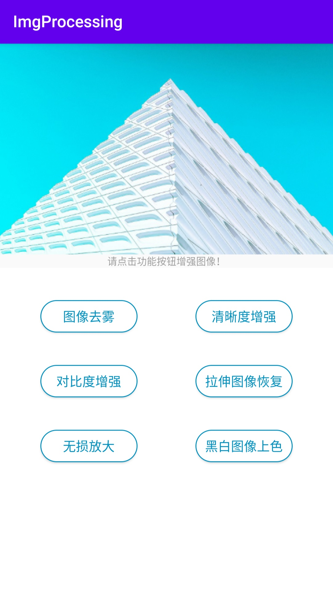
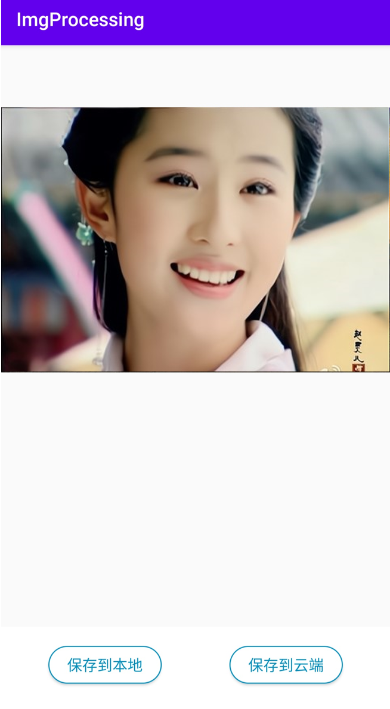

### 图像效果增强Android应用-ImgProcessing
+ 核心代码版本，此版本未添加用户管理功能
+ 本工程基于[百度云开放平台](https://cloud.baidu.com/product/imageprocess)API构建图像效果增强Android应用，主要提供图像去雾、清晰度增强、黑白图像上色等多种图像效果增强的服务

#### build.gradle (project: ImgProcessing)

+ `android studio 4.1.3`
+ `repositories`
  + replace with the repository of aliyun: https://maven.aliyun.com/repository

#### build.gradle (module: ImgProcessing.app)

+ `compileSdkVersion 30`
+ `buildToolsVersion '30.0.3'`
+ `minSdkVersion 16`
+ `targetSdkVersion 30`
+ import the jar lids: `fastjson.jar`
  + `implementation files('libs/fastjson-1.2.68.jar')`

#### The version of gradle

+ `gradle-6.8.3-all.zip`

#### Two main functions

+ Including two `Activity`
  + `MainActivity`：Call different image enhancement APIs
  + `ImgResultActivity`：Save the result to local storage or cloud server

+ The UI of this APP

  + UI of MainActivity

  

  + UI of ImgResultActivity

  

+ The result of image definition enhancement
  + input
  
     
     
  + output
  
     
     

